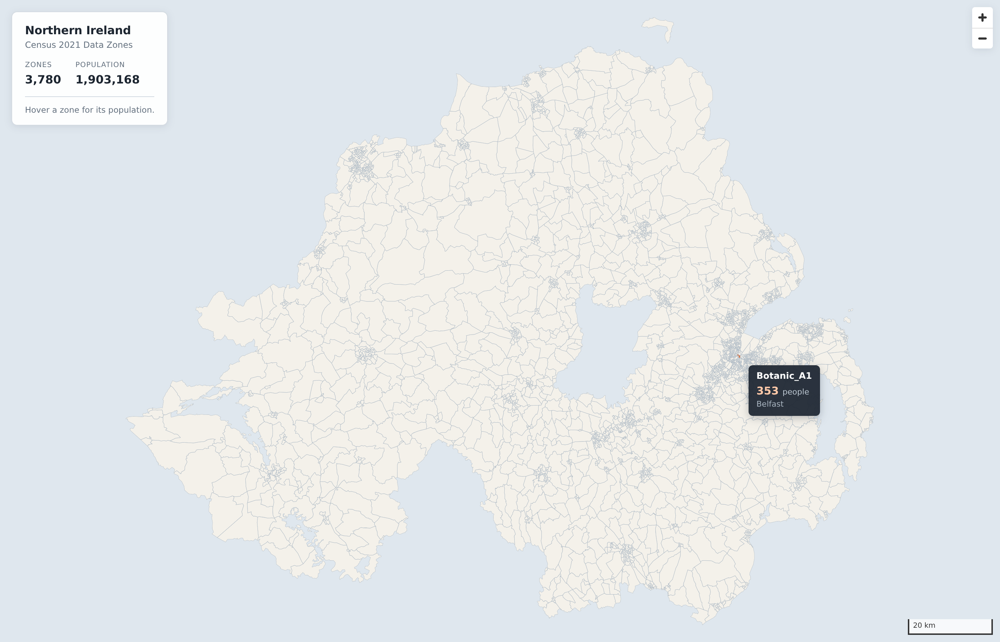

# NI Data Zones map

Interactive map of Northern Ireland's 3,780 Census 2021 Data Zones, with
population on hover.



## Quick start

```bash
./run.sh
```

First run fetches the toolchain (~28MB) and builds the map data and the adjacency
graph (a minute or two); after that it just serves. Then, **from your laptop**:

```bash
ssh -L 8765:localhost:8765 <user>@<this-box>
# or on an existing session: press Enter, then ~C , then:  -L 8765:localhost:8765
```

and open <http://localhost:8765>.

The server binds `127.0.0.1` only — this box has a public IP, so the app is
deliberately not exposed. Rendering happens in your laptop's browser, so only
the one-time ~0.8MB data fetch crosses the tunnel; pan, zoom and hover are local.

> Don't run a browser on the box through X11 forwarding — WebGL over X11 is
> painful-to-broken and would round-trip every frame.

Other flags: `./run.sh --rebuild` (force a data rebuild), `./run.sh --port 9000`.

## How it works

```
data/*.json      ──prepare_attributes.py──>  build/dz_attributes.csv
data/DZ2021.geojson ──build_map_data.sh────>  web/data/dz.geojson       ──> web/ app
                        (mapshaper)
data/DZ2021.geojson ──build_adjacency.py───>  web/data/dz_adjacency.json ──> web/ app
```

The two outputs come from the same source but not from each other: the graph is
built from the **full-resolution** boundaries, never the simplified ones.

| Script | Does |
|---|---|
| `scripts/setup_tools.sh` | node + mapshaper into `.tools/`, MapLibre into `web/vendor/`. No sudo. |
| `scripts/prepare_attributes.py` | NISRA flexible-table JSON → CSV |
| `scripts/build_map_data.sh` | mapshaper: simplify + join + trim fields |
| `scripts/verify_build.py` | asserts the map data is correct |
| `scripts/dz_topology.py` | exact boundary-segment topology, shared by the three below |
| `scripts/build_adjacency.py` | builds the adjacency graph; holds `WATER_CROSSINGS` |
| `scripts/dz_graph.py` | importable Python accessor for the graph |
| `scripts/verify_adjacency.py` | asserts the graph is correct |
| `scripts/audit_gaps.py` | review tool: finds close-but-not-adjacent pairs |
| `scripts/test_regions.mjs` | headless test of the region algorithm |
| `scripts/serve.py` | static server, gzip, localhost-only |
| `scripts/smoke_test.sh` | headless browser check + screenshots |

Everything build-time lives in `.tools/` and is disposable: `rm -rf .tools`.
Nothing in `web/` depends on node, and the running app makes **zero external
requests** — MapLibre is vendored.

### Why mapshaper

The source is 75MB with 1.76M vertices, and **60.5% of its points are shared
between neighbouring zones**. Simplification therefore has to be topology-aware:
anything per-polygon (`ogr2ogr -simplify`, Shapely's `.simplify(preserve_topology=True)`
— that flag preserves each polygon's *own* validity, not shared borders) tears
visible gaps between zones. mapshaper builds topology on import and simplifies
each shared arc once.

Result: 1,760,787 → 146,017 vertices (8.3%), 3.6MB, 0.7MB gzipped.

Tune with `SIMPLIFY=9% ./scripts/build_map_data.sh` — higher keeps more detail.

## Adding another DZ-level dataset

Drop the NISRA JSON in `data/`, then add **one line** to `TABLES` in
`scripts/prepare_attributes.py`:

```python
TABLES = [
    {"column": "pop",  "file": "ni-census21-people-dz21-96e78665.json"},
    {"prefix": "rel",  "file": "ni-census21-...religion...json"},   # 2-D: one column per category
]
```

Then `./run.sh --rebuild`. The loader handles 1-D (zone → number) and 2-D
(zone × category) tables; 2-D becomes one column per category, e.g. `rel_catholic`.

The religion table is already in `data/` and commented out ready to enable.

> **Note on the numbers:** DZ-level census counts carry NISRA's statistical
> disclosure control, so they're approximate by a person or two and won't
> reconcile exactly with published higher-level totals. The people table sums to
> 1,903,168 against the published 1,903,175.

## Adjacency

`web/data/dz_adjacency.json` answers *who borders whom* — 3,780 zones, 10,743
edges, one connected component.

```python
import sys; sys.path.insert(0, "scripts")     # when importing from the repo root
from dz_graph import load
g = load()
g.neighbours("N20001651")                      # ['N20001659']
g.are_neighbours("N20003391", "N20003778")     # True
```

```js
__graph.neighbours('N20001651')                // same answers in the browser
__graph.areNeighbours('N20003391', 'N20003778')
```

**Two zones are neighbours when they share a length of boundary**, plus three
declared water crossings. Three decisions are worth knowing about, because none
of them is forced by the data:

*Shared vertices are float-identical* in the source — 60.4% of boundary segments
are claimed by two zones — so adjacency is an exact computation. No tolerance, no
snapping, no spatial index.

*Zones meeting at a single point are not neighbours.* 342 pairs do: the two
diagonals where four zones meet at a crossroads. A contiguous region cannot pass
through a dimensionless point, so they are excluded — but they are recorded under
`point_touches`, readable via `g.point_touches(code)`, so the decision is visible
in the data rather than hidden in a script. One pair sharing 0.32 mm (a digitising
artifact where three zones meet; the next smallest real border is 0.61 m) is
counted here too — see `MIN_SHARED_M`.

*The mosaic excludes water.* Lough Neagh, Strangford, Belfast Lough, Lough Foyle
and Carlingford are uncovered holes and the coast is a hard edge, so places that
are genuinely connected share no boundary — and Rathlin Island falls out of the
graph entirely. `WATER_CROSSINGS` in `build_adjacency.py` bridges exactly three,
declared by zone name so the list can be checked by eye:

| Crossing | Gap | Why |
|---|---|---|
| `Erne_West_F3` ↔ `Erne_East_F1` | 104 m | River Erne at Enniskillen |
| `Downpatrick_B1` ↔ `Ards_Peninsula_N4` | 623 m | Strangford Narrows ferry |
| `The_Glens_B3` ↔ `The_Glens_B1` | 6.3 km | Rathlin Island ferry |

**The test is whether there is a real-world way across — a bridge or a ferry — not
how narrow the water is.** Somewhere you cannot cross is far away in the only
sense that matters, however close it looks on a map. So the two sides of Belfast
Lough, Lough Neagh and Lough Foyle are not neighbours, and neither is the mouth of
Larne Lough: 319 m of water, but nothing crosses it, so those zones stay 6 hops
apart by land. Without the three that *are* declared, the graph has two components
and Rathlin has degree 0.

To check the list against the geometry:

```bash
python3 scripts/audit_gaps.py     # ~30s, prints a table, changes nothing
```

It ranks every non-adjacent pair within 800 m by how many hops apart they are in
the land-only graph — proximity alone is a bad signal, since two zones on the same
stretch of coast are often metres apart across a harbour mouth and a short walk
apart by land. It cannot prove the list complete: it would not have found the
6.3 km Rathlin ferry, which is what the low-degree report at the end is for.

## Building regions

Set a number of regions and press **GO**. The app grows that many regions out of
seed zones until every Data Zone is claimed, then keeps nudging zones between
regions to even the populations up, until you press **STOP**. **PAUSE** holds a
run without ending it — the phase and all model state survive, so resuming
continues exactly where it left off; **STOP** is what restores the best state
and shows the results table.

Controls: number of regions, random seed (same seed gives the same map),
temperature, shape weight, frames per second, and how many model steps run per
frame. The two
phases get separate step controls because they want very different rates -- a
build step claims a whole zone and is worth watching, while an optimisation step
moves one zone in 3,780 and is invisible on its own.

The algorithm is in `web/regions.js`, deliberately free of DOM and MapLibre so it
can be driven headlessly — `web/app.js` only animates it and paints the result,
via `setFeatureState`, so no geometry is re-uploaded as regions change.

**The score** is a weighted sum of normalised terms. Population equality is the
reference term, carrying weight 1:

```
S_pop       = SUM_r (pop_r - target)^2 / E[d^2]        target = total / N
build delta = d * (d + 2*(pop_r - target)) / E[d^2]    assign unassigned d to r
move delta  = 2d * (d + pop_B - pop_A)    / E[d^2]     move d out of A into B
```

`E[d^2]` is the mean squared DZ population. Normalising puts every term in units
of *one typical move*, so the temperature is a plain number near 1 at any N and
weights are pure priorities rather than exchange rates between incompatible
units. Note the two deltas are different formulas — assigning an unclaimed zone
is not a move from nowhere.

**Shape** is the second term, a compactness penalty measured as a moment of
inertia about each region's own centroid:

```
A    = SUM a_z          Sx = SUM a_z x_z      Sxx  = SUM a_z (x_z^2 + y_z^2)
Sown = SUM a_z^2/(2pi)  Sy = SUM a_z y_z

I       = Sxx - (Sx^2 + Sy^2)/A + Sown
penalty = 2*pi*I / A^2                       1 for a disc, higher for anything else
S_shape = SUM_r (penalty_r - 1) / sigma_shape
```

Treating each zone as a point mass at its centroid means that identity never
needs the centroid, so a zone joining or leaving is four additions — the same
O(1) as the population delta, with no sampling, no bounding box and no
rotational bias. A square scores 1.047 (π/3), a 4:1 rectangle 2.22.

`Sown` — each zone's own moment, taken as a disc of equal area — stops a
one-zone region scoring 0 and so looking better than a circle, which would bias
the build towards keeping regions small. It decays as `1/k`.

`sigma_shape = mean_zone_area * N / total_area`, derived rather than measured,
and unlike the population term it **depends on N**. The origin is shifted to the
centre of the data before measuring, because `Sxx - (Sx^2+Sy^2)/A` is a small
difference of large numbers and raw projected metres throw away most of the
mantissa.

**People shape** is a third term, the same moment with *people* as the mass
instead of land:

```
I_pop       = Ppp - (Px^2 + Py^2)/P
penalty_pop = 2*pi*I_pop / (P * A)     1 = people spread evenly across the region
```

It exists because the two measures disagree — correlation 0.438 over a run.
DZ areas span a factor of 15,000 while populations span 15, so an area-weighted
centroid sits wherever the *ground* is: measured across one run it lands 0.3 to
8.4 km from where the people are. One region scored 1.20 on land (a tidy patch)
and 2.45 on people (strung out along a line); another scored 1.03 on land (very
nearly a disc) and 0.45 on people (everyone balled into one corner).

Note it has **no floor at 1**, unlike the land penalty. Concentrated population
scores below 1 and earns credit; the land term is what stops that being bought
with sprawl. Normalising by the region's own area does mildly reward absorbing
large thinly-populated zones — that was the deliberate trade against a fixed
scale, which has no such incentive but would steer rural regions hard and urban
ones barely at all.

Both sliders default to 1 and 0 turns a term off. The penalties are still
*measured* at weight 0 — about twenty flops per move — so the readout shows what
the shapes are even when they aren't being steered. At N=18 over 50,000 moves:

| weights | land | people |
|---|---|---|
| neither | 2.073 | 1.918 |
| land only | 1.245 | 1.311 |
| people only | 1.587 | 1.114 |
| **both** | **1.204** | **0.995** |

The last row is the point: together they beat either alone *on both measures*,
which is not something you would get from two terms pulling against each other.

**Temperature and shape weight are both live**, read every frame rather than
captured at GO, so you can steer a run while watching it. They differ in one
way that matters: temperature only affects the acceptance rule, so the score and
best-so-far keep meaning what they meant. The shape weight is part of the score,
so changing it is a change of objective — the model discards the old best and
re-bases it on the current state, otherwise STOP would restore a "best" scored
under a weight you are no longer using.

**Build phase.** Seeds are chosen by farthest-point sampling, because purely
random seeds clump and a region boxed in early can never recover — nothing is
ever stolen during the build. Then repeatedly: take the lowest-population region
that still borders an unassigned zone, and give it the neighbour that most
improves the score. Because the DZ graph is one connected component, some region
always borders an unassigned zone, so this always finishes.

Every 25 steps it also **seals pockets**: any connected group of unassigned zones
bordered by exactly one region is handed to that region whole. This is forced
rather than clever — a zone can only be claimed by a region already bordering it,
and nothing is stolen during the build, so no second region can ever reach such a
group. Until it is handed over the region looks smaller than it really is, so the
build keeps feeding it while it is already committed to the pocket and it
over-claims on its far side. It fires a lot — around 1,400 of 3,780 zones at
N=18 — improving the build score in 10 of 12 (N, seed) combinations tried,
sometimes by 2–3×, and finishing the build in ~2,350 steps instead of ~3,760.
`__model.sweepInterval = Infinity` turns it off.

**Optimisation phase.** Sample a zone on a region boundary, reject it if removing
it would split its region in two, then reassign it among its neighbouring regions
weighted by `exp(-delta / T)`. Straight after the build, regions differ by tens of
thousands of people, so normalised deltas reach several hundred — the softmax
subtracts the minimum before exponentiating, or it overflows immediately. A
pleasant side effect is that the phase starts nearly greedy and becomes genuinely
stochastic as it converges. `T` is held fixed rather than annealed, so the current
score plateaus and jitters while the best-so-far keeps improving; **STOP** restores
the best state visited, which is not the state it happened to stop in.

> **Two things worth knowing before reading the numbers.** The build phase on its
> own leaves a wide spread — around 60% max deviation at N=18 — because boxed-in
> regions stop growing. Closing that is the optimisation phase's job, and it
> typically gets under 1% within a couple of hundred thousand steps.
>
> Occasionally two regions come out of the build as a **sealed pocket**: they
> border only each other and one other region, every one of whose adjacent zones
> is an articulation point, so nothing can legally cross without splitting
> something. `N=18 seed 7` is such a case and is kept in the test suite. It is a
> narrow channel rather than a dead end — it escapes around 1.4M steps and lands
> near 0.5% — but it is the clearest illustration of why single-zone moves alone
> are limited. Swap moves are the standard fix, and are deferred.

## The app

`web/app.js` is split into data / map / layers / interaction so the planned
dynamic features drop in without restructuring:

```js
// recolour by any metric (e.g. a choropleth)
__map.setPaintProperty('dz-fill', 'fill-color', expression)

// swap the data live
__map.getSource('dz').setData(next)
```

Hover uses MapLibre `feature-state` keyed off the DZ code (via the source's
`promoteId`), so nothing re-renders per mouse move and there is no per-feature
DOM. `window.__map` is exposed as a console handle, with `window.__graph` and
`window.__model` beside it. The graph loads off the critical path — nothing on screen depends on it, so a
failure to fetch it warns to the console and leaves the map working.

## Verification

```bash
python3 scripts/verify_build.py      # map data assertions
python3 scripts/verify_adjacency.py  # graph assertions
node scripts/test_regions.mjs        # region algorithm, headless, ~12s
./scripts/smoke_test.sh              # headless render + hover, needs run.sh serving
```

`test_regions.mjs` drives `web/regions.js` against the real data and asserts that
every zone ends assigned, that **every region is contiguous** after the build and
after 50,000 moves, that the incrementally-maintained frontier set matches a
from-scratch recompute, that the incremental score matches a full rescore, that a
seed reproduces its map exactly, and that optimisation cuts the score by more
than 5x at N = 4, 18, 50 and 100.

`verify_build.py` checks 3,780 features, unique codes matching the source, all
rings closed and ≥4 points, and that populations sum to 1,903,168.

`verify_adjacency.py` checks the graph is symmetric and loop-free, has one
connected component and no isolated zone, that the three crossings resolve to the
declared names, and — the check that ties the two artifacts together — that
**simplification lost no shared border**. It gains three: writing at
`precision=0.00001` (~0.65 m) snaps vertices together and promotes three
full-resolution point touches into shared segments. Each is verified to be
exactly that, so the number is a bound on a known artifact rather than a fudge.

`smoke_test.sh` loads the page in headless Chromium, asserts no console errors,
no failed requests and no external requests, hovers a Belfast zone to confirm
the tooltip, and writes `map-full.png` / `map-hover.png` (override with `OUTDIR=`).

### Headless verification setup

This box has no browser, no GPU libs and **no fonts**, all of which were
installed into `.tools/` without sudo:

```bash
cd .tools/pptr && npm install puppeteer
# the bundled installer fails here; fetch the browser manually:
curl -fsSL -o /tmp/chs.zip \
  https://storage.googleapis.com/chrome-for-testing-public/<ver>/linux64/chrome-headless-shell-linux64.zip
# then, without sudo, for the missing shared libs and fonts:
cd .tools/debs && apt-get download libasound2t64 libatk1.0-0t64 libatk-bridge2.0-0t64 \
  libatspi2.0-0t64 libgbm1 libxcomposite1 libxdamage1 libxfixes3 libxrandr2 \
  libxi6 libxrender1 libxres1 fonts-dejavu-core
for d in *.deb; do dpkg-deb -x "$d" ../sysroot; done
```

`smoke_test.sh` wires up `LD_LIBRARY_PATH` and `FONTCONFIG_FILE` for these.
Without the fonts, text renders as zero-width glyphs and screenshots look blank.

## Data

| File | Contents |
|---|---|
| `data/DZ2021.geojson` | 3,780 Data Zones (NISRA, 2021) |
| `data/SDZ2021.geojson` | 850 Super Data Zones — parent tier, unused so far |
| `data/ni-census21-people-dz21-*.json` | population per DZ |
| `data/ni-census21-...religion...json` | religion per DZ × 4 categories |

Hierarchy is a clean tree: DZ → SDZ → DEA → LGD. Source `.geojson` files are
gitignored (large); the census JSON is small enough to keep.
